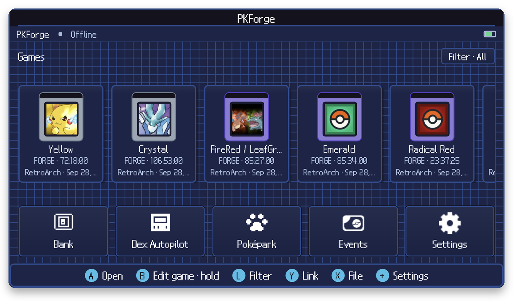
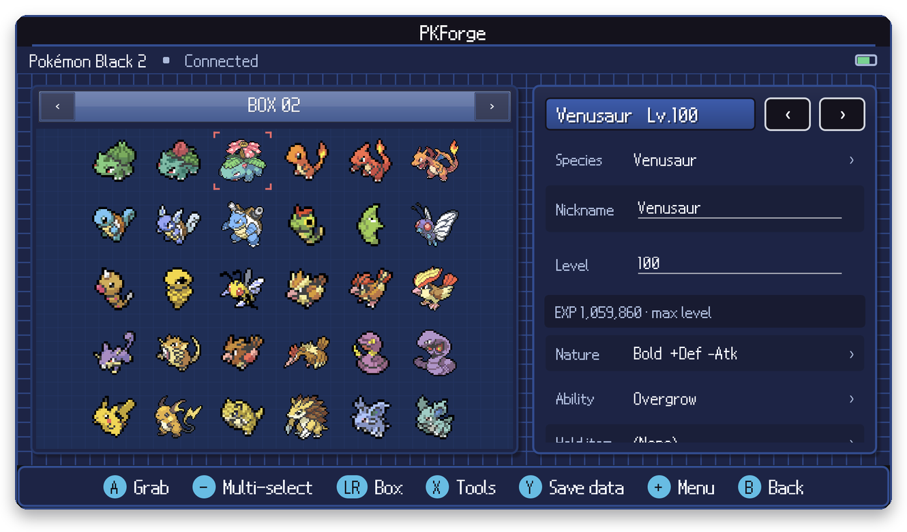
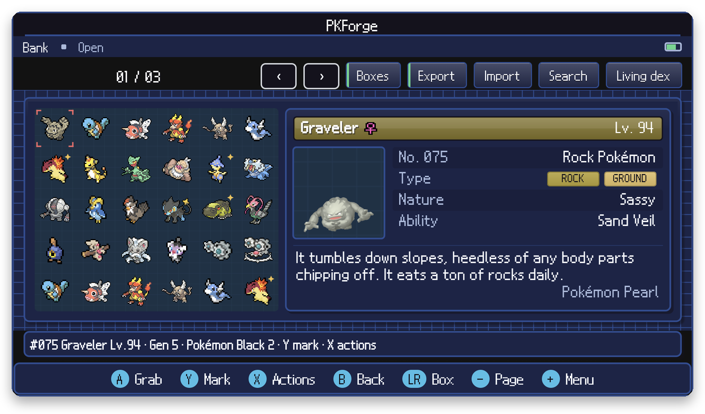
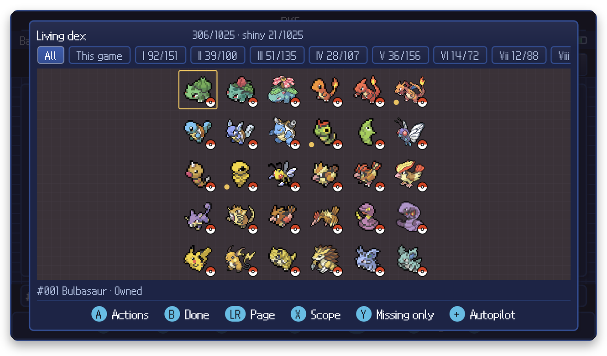

<p align="center"></p>

<h1 align="center">PKForge for Mac</h1>

<p align="center">A Pokémon save editor and bank, running natively on macOS.<br/>
A port of <a href="https://github.com/sofianeelhor/PKForge">PKForge</a> by @22sh.</p>

<p align="center">
  <a href="../../releases"></a>
  
  <a href="LICENSE"></a>
</p>

---

Open a save from your emulator, edit your team and boxes, and move Pokémon between games.
Built on [PKHeX.Core](https://github.com/kwsch/PKHeX), with the
[Auto Legality Mod](https://github.com/santacrab2/PKHeX-Plugins) built in, so legality
checks and one-tap legalize work offline.

> [!WARNING]
> **This is a beta and it needs testers.** It works, but it hasn't been used by many people
> yet. Back up any save you care about before editing it, and check your edits in the
> emulator. PKForge also keeps its own backup of every save it writes.
> Found a problem? See [Help test](#help-test).

> [!NOTE]
> **This fork** ([Skipper07-coder-sys/PKForge-Mac](https://github.com/Skipper07-coder-sys/PKForge-Mac), branch
> `local-fixes`) brings the Mac port up to **PKForge 3.1.0** and adds:
> - builds with Xcode 27 (no Android workload needed; macOS 14 or later)
> - one window by default: the second screen is optional (**⌘2**, or Settings ▸ Misc ▸ Second screen)
> - pickers (items, moves, species…) drop down under the field you click and filter as you type
>   (↑ ↓ to move, Return to pick, Esc to close)
> - Mac habits: keys match the hints (Return, Esc, X, Y, L, R, +, −), drag and drop between boxes,
>   right-click for a Pokémon's menu, **⌘S** save, **⌘Z** undo the last change, **⌘O** open and
>   **File ▸ Open Recent**, and **Open With ▸ PKForge** (or a drop on the Dock icon) for .sav/.srm/.dsv/.gci files
> - item descriptions in each game's own words (Emerald's Safari Ball is for the SAFARI ZONE)
> - an experimental single-screen iPhone/iPad build: `tools/build-ios.sh` (simulator or device)

Not affiliated with Nintendo, Game Freak, or The Pokémon Company.

## Features

- Edit anything on a Pokémon: stats, IVs/EVs, moves, nature, ability, item, origin,
  Tera type, shininess and more, with a live legality check
- Move Pokémon between games, across generations
- A cross-game Bank with unlimited boxes, and a Living Dex tracker for all 1025
- The full Mystery Gift database, offline
- Bag, trainer, Pokédex, Day Care and game-specific editors
- RNG tools, batch editing, Showdown import/export
- Restore points for every change

<p align="center">
  
  
</p>
<p align="center">
  
  
</p>

## Getting started

1. **Install.** Download `PKForge-mac.zip` from [Releases](../../releases), unzip it, and drag
   PKForge into Applications. Needs macOS 13 or later.
2. **Save in your game, then quit the emulator.** PKForge edits the save file, so the
   emulator shouldn't have it open.
3. **Link your emulator.** In PKForge, open **Settings ▸ Link an emulator**, pick your console
   and emulator, and choose the folder your saves are in. Your games appear on the shelf.
   (No emulator? **Settings ▸ Open a save file** works with any save.)
4. **Edit.** Click a game to open its boxes, click a Pokémon, change what you like, and hit
   **Save changes**.
5. **Play.** Start the game normally in your emulator. Don't load an older save state, or
   you'll undo your edits.

Made a mistake? **Settings ▸ Restore points** puts any earlier version of the save back.

## Emulators

Supported in **Link an emulator**:

| Platform | Emulators |
| --- | --- |
| Game Boy, GBC, GBA | mGBA, OpenEmu, RetroArch |
| DS | melonDS, DeSmuME, OpenEmu, RetroArch |
| GameCube | Dolphin |
| 3DS | Azahar / Lime3DS |
| Switch | Eden |

Not sure where your saves are? The folder picker opens in the emulator's usual save folder when
it can find one. melonDS, mGBA and DeSmuME keep saves next to your ROMs by default.

<details>
<summary>Supported games</summary>

- **Gen I–II:** Red, Blue, Green (JP), Yellow, Gold, Silver, Crystal
- **Gen III:** Ruby, Sapphire, Emerald, FireRed, LeafGreen, Box, Colosseum, XD
- **Gen IV:** Diamond, Pearl, Platinum, HeartGold, SoulSilver
- **Gen V:** Black, White, Black 2, White 2
- **Gen VI:** X, Y, Omega Ruby, Alpha Sapphire
- **Gen VII:** Sun, Moon, Ultra Sun, Ultra Moon, Let's Go Pikachu, Let's Go Eevee
- **Gen VIII:** Sword, Shield, Brilliant Diamond, Shining Pearl, Legends: Arceus
- **Gen IX:** Scarlet, Violet
- **Romhacks:** Unbound, Radical Red, GS Chronicles, Luminescent Platinum, Compass

</details>

## Help test

The most useful things to try:

- Your own saves, from the emulators and games you actually play
- Moving Pokémon between two games, and in and out of the Bank
- Editing, saving, then loading the save in your emulator
- Keyboard and controller navigation

If something breaks, [open an issue](../../issues/new?template=bug_report.md) with the game,
the emulator, your Mac and macOS version, and what happened. A screenshot helps. Don't attach
save files you want to keep private.

## Controls

Mouse, keyboard or a controller (Xbox, PlayStation, Switch, MFi).

| | Keyboard |
| --- | --- |
| D-pad | Arrow keys |
| A / B | Return or Space / Esc or Delete |
| X / Y | X / Y |
| L / R | L / R, or Page Up / Page Down |
| Start / Select | + or Tab / − |

Keys go by the character typed, so they match on any layout (QWERTZ's Y is Y). With no controller
connected the hints name these keys; Help ▸ Keyboard & Controller lists them. Right-click does what a
long press does. **⌘Z** (Edit ▸ Undo) takes back the save's last edit or move, one at a time, from its
restore point; Bank deposits and transfers between games are not undone (that would duplicate the
Pokémon) — Settings ▸ Restore points has every earlier state. PKForge starts in one window: pick a Pokémon, then
Menu ▸ Summary for its details. **Window ▸ Second Screen** (⌘2) or Settings ▸ Misc ▸ Second screen
opens the lower screen as its own window (the dual-screen handheld layout) and remembers the choice.

Your Bank and backups live in `~/Library/Application Support/PKForge`.

## Building

Needs Xcode and the .NET 10 SDK with the `maui-maccatalyst` workload.

```bash
git clone --recursive -b local-fixes https://github.com/Skipper07-coder-sys/PKForge-Mac.git
cd PKForge-Mac
tools/build-mac.sh
```

If `xcode-select` still points at the Command Line Tools, prefix the build with
`DEVELOPER_DIR=/Applications/Xcode.app/Contents/Developer`.

The app lands in `dist/`. To sign and notarize a release, set `PKFORGE_SIGN_IDENTITY` to your
Developer ID and `PKFORGE_NOTARY_PROFILE` to a `notarytool` keychain profile first.

## Credits

- [PKForge](https://github.com/sofianeelhor/PKForge) by @22sh, the app this is a port of
  (the Android version and its Discord live there). Logo by @spritedmistery.
- Mac port by [@macprotips](https://github.com/macprotips), with the majority of the port done by
  **Claude Opus 5.5**
- [PKHeX](https://github.com/kwsch/PKHeX), the engine everything runs on
- [PKHeX-Plugins / Auto Legality Mod](https://github.com/santacrab2/PKHeX-Plugins)
- [PKSM](https://github.com/FlagBrew/PKSM), the pixel UI this builds on
  ([attribution](src/PKForge.App/Resources/UI/ATTRIBUTION.md))
- [SteamGridDB](https://www.steamgriddb.com) game art
  ([attribution](src/PKForge.App/Resources/GameArt/ATTRIBUTION.md)),
  [PokeAPI](https://pokeapi.co) item art,
  [game-icons.net](https://game-icons.net) icons (CC-BY 3.0),
  [Bulbagarden Archives](https://archives.bulbagarden.net) Pokérus sprites
- Emulator names belong to their projects. Pokémon names and sprites © Nintendo,
  Creatures Inc., GAME FREAK inc.

## License

GPLv3 or later, inherited from PKHeX.Core. See [LICENSE](LICENSE).
